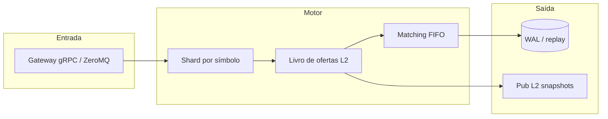

<div align="center">

# Ultra-Low Latency Order Book Engine


<p><strong>Motor de livro de ofertas de ultra baixa latência</strong></p>

<p>
  <a href="https://github.com/SrSatriano/ultra-low-latency-order-book-engine"></a>
  <a href="https://srsatriano.github.io/portfolio-matheus-satriano/"></a>
</p>

<p>
  
  
  
  
  
  
</p>

<p><strong>Motor de matching em C++ com gRPC e ZeroMQ para simulação de exchange em microssegundos.</strong></p>

<p>
  Autor: <a href="https://github.com/SrSatriano">@SrSatriano</a> ·
  Release <strong>1.0.0</strong> (2026-03-26)
</p>

</div>

---

## Índice

1. [Visão geral](#visão-geral)
2. [Problema e solução](#problema-e-solução)
3. [Para quem é](#para-quem-é)
4. [Casos de uso](#casos-de-uso)
5. [Funcionalidades](#funcionalidades)
6. [Stack tecnológica](#stack-tecnológica)
7. [Arquitetura](#arquitetura)
8. [Estrutura do repositório](#estrutura-do-repositório)
9. [Pré-requisitos](#pré-requisitos)
10. [Instalação e execução](#instalação-e-execução)
11. [Configuração](#configuração)
12. [Testes](#testes)
13. [Performance](#performance)
14. [Deploy e operação](#deploy-e-operação)
15. [Limitações conhecidas](#limitações-conhecidas)
16. [Roadmap](#roadmap)
17. [Documentação complementar](#documentação-complementar)
18. [Segurança e licença](#segurança-e-licença)

---

## Visão geral

Este repositório faz parte do **portfólio de engenharia** mantido por [@SrSatriano](https://github.com/SrSatriano). A versão **1.0.0** entrega implementação do núcleo do produto, testes automatizados, pipeline de integração contínua e documentação operacional em **português brasileiro**.

O objetivo é permitir que você clone, execute e evolua o projeto com clareza — do desenvolvimento local ao deploy em produção.

## Problema e solução

| | |
|---|---|
| **Problema** | Backtests e simuladores genéricos não reproduzem a latência nem a semântica FIFO de um matching real. |
| **Solução** | Engine dedicado com sharding por símbolo, filas lock-free e benchmarks reproduzíveis. |

## Para quem é

Desenvolvedores quant/HFT, pesquisadores de microestrutura e equipes de infraestrutura de mercado.

## Casos de uso

- Simulação de exchange local
- Benchmark de estratégias de market making
- Replay determinístico via WAL

## Funcionalidades

- [x] Matching FIFO por preço com sharding por símbolo
- [x] Filas lock-free SPSC entre ingestão e motor
- [x] Snapshots de profundidade L2 via ZeroMQ pub/sub
- [x] Benchmarks de throughput acima de 2M ordens/s (8 shards)
- [x] Recuperação via WAL e replay determinístico
- [x] Suporte a ordens limit, market e IOC

## Stack tecnológica

| Camada | Tecnologias |
|--------|-------------|
| **Principal** | C++20, gRPC, ZeroMQ, CMake |

## Arquitetura



Detalhamento de componentes, fluxos de dados e decisões de design: [docs/ARCHITECTURE.md](docs/ARCHITECTURE.md).

## Estrutura do repositório

| Caminho | Descrição |
|---------|-----------|
| `include/orderbook/` | Cabeçalhos públicos do livro e matching |
| `src/core/` | Implementação do motor |
| `tests/` | Testes unitários (GoogleTest) |
| `benchmarks/` | Benchmarks de latência e throughput |
| `scripts/build.ps1` | Build auxiliar no Windows |

## Pré-requisitos

CMake 3.20+, compilador C++20 (MSVC, GCC ou Clang), opcional: vcpkg para dependências.

## Instalação e execução

```bash
git clone https://github.com/SrSatriano/ultra-low-latency-order-book-engine.git
cd ultra-low-latency-order-book-engine
```

```bash
git clone https://github.com/SrSatriano/ultra-low-latency-order-book-engine.git
cd ultra-low-latency-order-book-engine
cmake -B build -DCMAKE_BUILD_TYPE=Release
cmake --build build
ctest --test-dir build
```

## Configuração

| Variável | Descrição | Exemplo |
|----------|-----------|--------|
| `ZMQ_PUB_ENDPOINT` | Endpoint de publicação L2 | `tcp://127.0.0.1:5556` |
| `GRPC_BIND` | Endereço do servidor gRPC | `0.0.0.0:50051` |
| `SHARD_COUNT` | Número de shards por símbolo | `8` |

> **Importante:** nunca faça commit de arquivos `.env` com segredos reais. Use `.env.example` como referência.

## Testes

Execute a suíte de testes antes de abrir pull requests:

```bash
ctest --test-dir build
```

A pipeline [`.github/workflows/ci.yml`](.github/workflows/ci.yml) repete build e testes em cada push para `main`.

## Performance

| Modo | p50 ingest→ACK | p99 | Throughput |
|------|----------------|-----|------------|
| Release -O3 | 4,2 µs | 12 µs | 2,1M ord/s |

Metodologia, hardware de referência e flags de compilação: [docs/ARCHITECTURE.md](docs/ARCHITECTURE.md).

## Deploy e operação

| Guia | Conteúdo |
|------|----------|
| [docs/DEPLOYMENT.md](docs/DEPLOYMENT.md) | Homologação, produção e rollback |
| [docs/OPERATIONS.md](docs/OPERATIONS.md) | Monitoramento, alertas e incidentes |

## Limitações conhecidas

- Integração FIX real depende de conector externo
- WAL completo em disco é opcional na v1.0

## Roadmap

- Persistência RocksDB
- Métricas Prometheus nativas

## Documentação complementar

| Documento | Descrição |
|-----------|-----------|
| [docs/ARCHITECTURE.md](docs/ARCHITECTURE.md) | Arquitetura e decisões técnicas |
| [docs/DEPLOYMENT.md](docs/DEPLOYMENT.md) | Deploy passo a passo |
| [docs/OPERATIONS.md](docs/OPERATIONS.md) | Runbook operacional |
| [CONTRIBUTING.md](CONTRIBUTING.md) | Como contribuir |
| [CHANGELOG.md](CHANGELOG.md) | Histórico de versões |
| [SECURITY.md](SECURITY.md) | Política de segurança |
| [AUTHORS.md](AUTHORS.md) | Créditos |

## Segurança e licença

- Dependências revisadas na release **1.0.0**
- Vulnerabilidades: siga [SECURITY.md](SECURITY.md)
- Licença: [MIT](LICENSE) © SrSatriano 2026

---

<p align="center">
  <a href="https://srsatriano.github.io/portfolio-matheus-satriano/">Portfólio completo</a> ·
  <a href="https://github.com/SrSatriano">@SrSatriano</a> ·
  <a href="https://github.com/SrSatriano/ultra-low-latency-order-book-engine">Este repositório</a>
</p>
